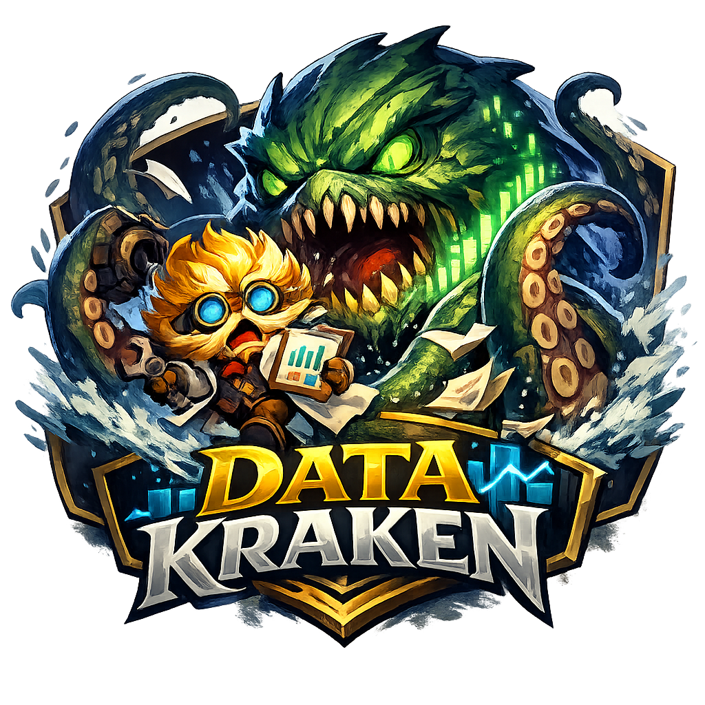

# data_kraken



Plataforma de analytics de eSports (League of Legends) com pipeline de dados e interface em Streamlit.

## Objetivo

Entregar um fluxo reproduzível de coleta, transformação e publicação de dados para exploração analítica de partidas, jogadores e equipes.

## Estrutura principal

- `golgg/`: código principal da aplicação e pipeline
- `tests/`: testes automatizados
- `streamlit_app.py`: entrypoint do Streamlit
- `requirements.txt`: dependências Python do projeto

## Fluxo da aplicação

1. Executar pipeline para preparar/atualizar dados.
2. Opcionalmente baixar assets visuais (logos/champions/imagens) no mesmo fluxo.
3. Iniciar Streamlit para navegação analítica.

## Como executar

### 1) Instalar dependências

```powershell
python -m pip install -r requirements.txt
python -m playwright install
```

### 2) Ativar ambiente

```powershell
Set-Location .
& .venv\Scripts\Activate.ps1
```

### 3) Rodar pipeline

```powershell
python -m golgg.main
```

Com assets (imagens/logos):

```powershell
python -m golgg.main --with-assets
```

### 4) Rodar Streamlit

```powershell
python -m streamlit run streamlit_app.py
```

### 5) Rodar testes

```powershell
python -m pytest -q
```

